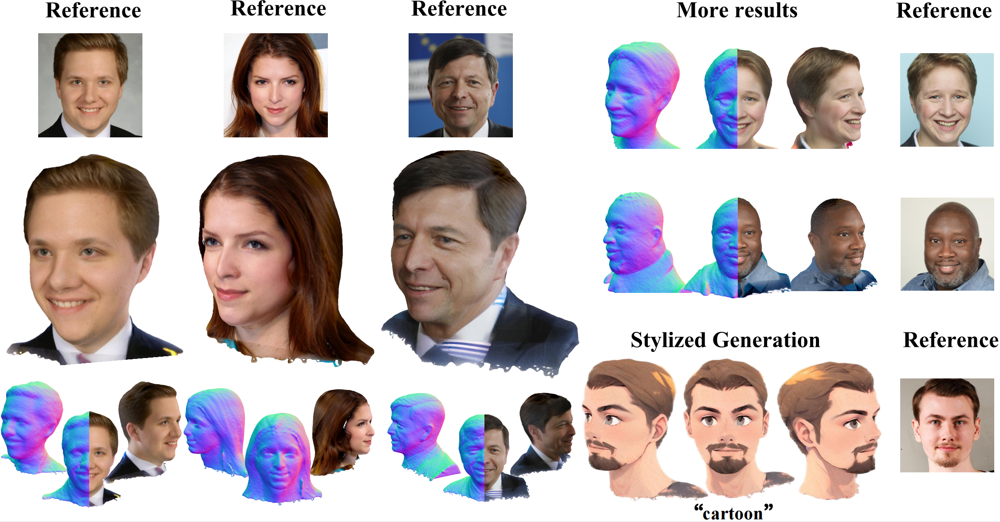
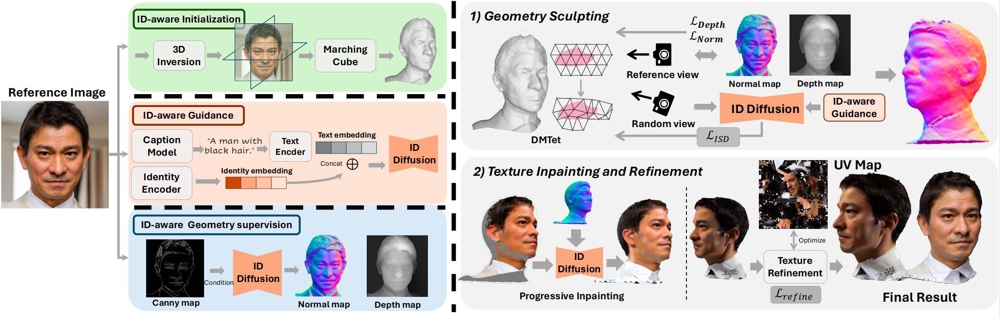

# [AAAI 2025] ID-Sculpt: ID-aware 3D Head Generation from Single In-the-wild Portrait Image

### [Project Page](https://jinkun-hao.github.io/IDSculpt/) | [Paper](https://arxiv.org/abs/2406.16710)

Official implementation of ID-Sculpt, a method for generating high-quality and realistic 3D Head from Single In-the-wild Portrait Image.


[Jinkun Hao](https://github.com/jinkun-hao/Portrait3D)<sup>1</sup>,
[Junshu Tang](https://junshutang.github.io/)<sup>1</sup>,
[Jiangning Zhang](https://zhangzjn.github.io/)<sup>2</sup>,
[Ran Yi](https://yiranran.github.io/)<sup>1</sup>,
[Yijia Hong](https://github.com/jinkun-hao/Portrait3D)<sup>1</sup>,
[Moran Li](https://github.com/jinkun-hao/Portrait3D)<sup>2</sup>,
[Weijian Cao](https://github.com/jinkun-hao/Portrait3D)<sup>2</sup><br>,
[Yating Wang](https://github.com/jinkun-hao/Portrait3D)<sup>1</sup>,
[Chengjie Wang](https://github.com/jinkun-hao/Portrait3D)<sup>2</sup>,
[Lizhuang Ma](https://github.com/jinkun-hao/Portrait3D)<sup>1</sup><br>
<sup>1</sup>Shanghai Jiao Tong University, <sup>2</sup>Youtu Lab, Tencent


<!--  -->

<!--  -->


## Installation

**This part is the same as the original [threestudio](https://github.com/threestudio-project/threestudio). Skip it if you already have installed the environment.**


- You must have an NVIDIA graphics card with at least 20GB VRAM and have [CUDA](https://developer.nvidia.com/cuda-downloads) installed.
- Install `Python >= 3.8`.
- (Optional, Recommended) Create a virtual environment:

```sh
pip3 install virtualenv # if virtualenv is installed, skip it
python3 -m virtualenv venv
. venv/bin/activate

# Newer pip versions, e.g. pip-23.x, can be much faster than old versions, e.g. pip-20.x.
# For instance, it caches the wheels of git packages to avoid unnecessarily rebuilding them later.
python3 -m pip install --upgrade pip
```

- Install `PyTorch >= 1.12`. We have tested on `torch1.12.1+cu113` and `torch2.0.0+cu118`, but other versions should also work fine.

```sh
# torch1.12.1+cu113
pip install torch==1.12.1+cu113 torchvision==0.13.1+cu113 --extra-index-url https://download.pytorch.org/whl/cu113
# or torch2.0.0+cu118
pip install torch torchvision --index-url https://download.pytorch.org/whl/cu118
```

- (Optional, Recommended) Install ninja to speed up the compilation of CUDA extensions:

```sh
pip install ninja
```

- Install dependencies:

```sh
pip install -r requirements.txt
```
- (Optional) `tiny-cuda-nn` installation might require downgrading pip to 23.0.1

## Download Pretrained Models
1. cd sd_model
2. Download fine-tuned text to humannormal models (Humannorm CVPR24) on HuggingFace: [Normal-adapted-model](https://huggingface.co/xanderhuang/normal-adapted-sd1.5/tree/main), [Depth-adapted-model](https://huggingface.co/xanderhuang/depth-adapted-sd1.5/tree/main)
3. Download controlnet: (All model on huggingface is torch.float16 weight detype)
    1. normal ('models--lllyasviel--control_v11p_sd15_normalbae')
    2. canny ('models--lllyasviel--control_v11p_sd15_canny')
    3. landmark ('models--CrucibleAI--ControlNetMediaPipeFace')
4. Prepare insightface checkpoint.
    Downloading [buffalo_l](https://drive.google.com/file/d/1qXsQJ8ZT42_xSmWIYy85IcidpiZudOCB/view?usp=sharing) and unpack the buffalo_l.zip file, organize the insightface like:
    ```
    ./sd_model
    └── insightface/
        └── models/
            └── buffalo_l/
    ```
5. Prepare IP-Adapter checkpoint. Download [ip-adapter-faceid-portrait-v11_sd15](https://huggingface.co/h94/IP-Adapter-FaceID) follow IP-Adapter official [guideline](https://github.com/tencent-ailab/IP-Adapter).
6. Download other models:
    1. models--stabilityai--sd-vae-ft-mse
    2. models--runwayml--stable-diffusion-v1-5
    3. models--SG161222--Realistic_Vision_V4.0_noVAE
    4. Download [vgg16](https://download.pytorch.org/models/vgg16-397923af.pth) to $/root/.cache/torch/hub/checkpoints/vgg16-397923af.pth


After downloading, the `sd_model/` is structured like:
```
./pretrained_models
├── insightface/
├── models--stabilityai--sd-vae-ft-mse/
├── models--runwayml--stable-diffusion-v1-5/
├── models--runwayml--stable-diffusion-v1-5/
├── models--SG161222--Realistic_Vision_V4.0_noVAE/
├── models--lllyasviel--control_v11p_sd15_normalbae/
├── models--lllyasviel--control_v11p_sd15_canny/
├── models--CrucibleAI--ControlNetMediaPipeFace/
├── models--CrucibleAI--ControlNetMediaPipeFace/
└── models--xanderhuang--normal-adapted-sd1.5/
```

## Download Tets
You can download the predefined Tetrahedra for DMTET from [this link](https://huggingface.co/xanderhuang) or generate locally.
After downloading, the `load/` is structured like:
```
./load
├── lights/
├── shapes/
└── tets
    ├── ...
    ├── 128_tets.npz
    ├── 256_tets.npz
    └── 512_tets.npz
```

## Data Preparasion
See [preprocess/README.md](preprocess/README.md)

```
preprocess_data/
├── ...
└── id_xxx
    ├── mask/
        ├── ...
        ├── 030.png
        └── 031.png
    ├── normal/
        ├── ...
        ├── 030.png
        └── 031.png
    ├── rgb/
        ├── ...
        ├── 030.png
        └── 031.png
    ├── cam_params.json     # cam_param corresponding to img in mask/normal/rgb
    ├── camera.npy          # reference view cam_param
    ├── face_mask.png       # mask of face region
    ├── img_canny.png
    ├── img_depth.png
    ├── img_normal.png
    ├── img.png             # reference portrait image
    ├── init_mesh.ply       # initialized mesh
    ├── laion.txt           # face landmark coordinates
    └── mask.png            # mask of forground region
```

## Quick Start

1st. Link sd models to current project path:
```bash
ln -s ../../../sd_model sd_model
```

2ed. Preprocessing:     
- put images to `preprocess/dataset/head_img_new` 
- add image captions in `preprocess/get_facedepth.py` and `preprocess/get_facenormal.py`    
- run preprocessing: `cd preprocess && source preprocess.sh`

3rd. Run optimization: modify variables (`prompt`, `image_path` and `tag`) in `run_exp.py`. Then
```bash
python run_exp.py
```


## Citation
If you find our work useful in your research, please cite:
```
@misc{hao2024portrait3d,
  title={Portrait3D: 3D Head Generation from Single In-the-wild Portrait Image}, 
  author={Jinkun Hao and Junshu Tang and Jiangning Zhang and Ran Yi and Yijia Hong and Moran Li and Weijian Cao and Yating Wang and Lizhuang Ma},
  year={2024},
  eprint={2406.16710},
  archivePrefix={arXiv},
}
```

## Acknowledgments

Our project benefits from the amazing open-source projects:

- [ThreeStudio](https://github.com/threestudio-project/threestudio)
- [Diffusers](https://huggingface.co/docs/diffusers/index)
- [PanoHead](https://github.com/SizheAn/PanoHead)
- [Humannorm](https://github.com/xhuangcv/humannorm)
- [IP-Adapter](https://github.com/tencent-ailab/IP-Adapter)

We are grateful for their contribution.